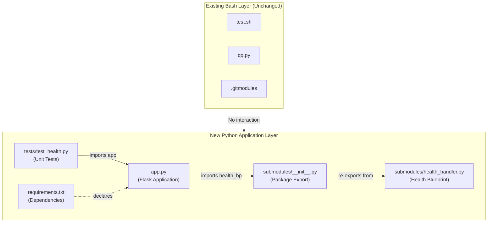

# Technical Specification

# 0. Agent Action Plan

## 0.1 Intent Clarification

### 0.1.1 Core Feature Objective

Based on the prompt, the Blitzy platform understands that the new feature requirement is to **add an HTTP health check endpoint** to the existing Submodule Test Repository — a Bash-based Git submodule validation utility that currently contains no HTTP server capabilities, no web framework, and no Python application code.

The specific requirements are:

- **Health Endpoint**: Introduce an HTTP endpoint (conventionally `/health`) that confirms the application server is operational
- **Handler in Submodules**: The endpoint's handler logic must reside in a Python sub-module package (i.e., a `submodules/` directory organized as a Python package), separating routing from business logic
- **JSON Response**: The endpoint must return the exact JSON payload `{"health": "ok"}` with an HTTP `200 OK` status code when the server is running and responsive
- **Liveness Confirmation**: The endpoint's purpose is to verify that the code is actively running and can respond to HTTP requests — a standard liveness probe pattern
- **Unit Tests**: Comprehensive unit tests must be added to validate the health endpoint behavior, including response status, content type, and JSON body

Implicit requirements detected:

- A Python HTTP web framework must be introduced to the repository (currently Bash-only)
- A dependency management manifest (`requirements.txt`) must be created
- A test framework must be integrated (currently no testing infrastructure exists, as confirmed by Section 6.6 of the technical specification)
- The Python application must coexist with the existing Bash scripts without disrupting their functionality
- The health endpoint must be self-contained and not depend on Git submodule state or Bash script execution

### 0.1.2 Special Instructions and Constraints

- **Handler in Submodules**: The user explicitly requires the handler to be placed in a "submodules" structure. In the context of this repository — which contains Git submodules under `subrepos/` and `subrepo_3/` — "submodules" refers to **Python sub-modules** (a `submodules/` Python package), not the existing Git submodule directories. The handler code will be organized in a `submodules/` Python package to honor this directive.
- **Maintain Existing Functionality**: The existing Bash scripts (`test.sh`, `qq.py`), `.gitmodules` configuration files, empty JavaScript placeholders (`subrepos/qq.js`, `subrepos/qq1.js`), and the Git submodule hierarchy must remain completely untouched.
- **Minimal Footprint**: Consistent with the repository's "Intentional Minimalism" architectural principle (Section 5.1.1), the new feature should introduce the fewest possible dependencies while fully satisfying requirements.
- **Repository Conventions**: The repository currently has no Python package structure, no dependency manifests, and no test framework. All of these must be introduced as new artifacts.

### 0.1.3 Technical Interpretation

These feature requirements translate to the following technical implementation strategy:

- To **serve an HTTP health endpoint**, we will create a Flask-based Python web application (`app.py`) at the repository root that registers a `/health` route and starts a development server
- To **place the handler in submodules**, we will create a `submodules/` Python package containing a `health_handler.py` module that defines a Flask Blueprint with the health route handler, and export it via `submodules/__init__.py`
- To **return JSON `{"health": "ok"}` with HTTP 200**, we will implement the handler function using Flask's `jsonify()` to produce a properly formatted JSON response with the `application/json` content type and a `200` status code
- To **confirm code is running**, the health endpoint's ability to respond to an HTTP GET request inherently confirms the Flask application process is alive and accepting connections
- To **add unit tests**, we will create a `tests/` directory with pytest-based test modules that use Flask's built-in test client to verify the health endpoint's status code, content type, and JSON response body
- To **manage dependencies**, we will create a `requirements.txt` file declaring Flask 3.1.3 and pytest 9.0.2 as the project's Python dependencies

## 0.2 Repository Scope Discovery

### 0.2.1 Comprehensive File Analysis

The Submodule Test Repository is a compact, Bash-based developer utility with six tracked source artifacts across three directory levels. The complete current file inventory and its relevance to the health endpoint feature is documented below.

**Existing Files — Assessment for Modification**

| File Path | Type | Current Purpose | Modification Required | Rationale |
|---|---|---|---|---|
| `test.sh` | Bash script (43 lines) | Primary automation script for Git submodule file generation | No | Unrelated to HTTP health endpoint; must remain unchanged |
| `qq.py` | Bash script (0 bytes in repo) | Duplicate variant of `test.sh` with misleading `.py` extension | No | Not a Python file despite extension; unrelated to feature |
| `.gitmodules` (root) | Git config (15 lines) | Declares 3 first-level submodules with SSH URLs | No | Git submodule configuration; unrelated to feature |
| `subrepos/subrepo_2/.gitmodules` | Git config (3 lines) | Declares nested `subrepo_4` submodule | No | Nested submodule config; unrelated to feature |
| `subrepos/qq.js` | JavaScript (0 bytes) | Empty placeholder file | No | Empty structural placeholder; unrelated to feature |
| `subrepos/qq1.js` | JavaScript (0 bytes) | Empty placeholder file | No | Empty structural placeholder; unrelated to feature |

**Existing Directories — Impact Assessment**

| Directory | Contents | Impact | Modification Required |
|---|---|---|---|
| `/` (root) | Scripts, `.gitmodules`, committed files, large binary files | New Python files added alongside existing content | Yes — new files added at root level |
| `subrepos/` | Empty JS files, `subrepo_1/`, `subrepo_2/` Git submodules | No changes to this directory | No |
| `subrepo_3/` | Git submodule (submodule_test_submodule_3) | No changes to this directory | No |
| `subrepos/subrepo_1/` | Git submodule (submodule_test_submodule_1) | No changes | No |
| `subrepos/subrepo_2/` | `.gitmodules`, Git submodule mount | No changes | No |
| `subrepos/subrepo_2/subrepo_4/` | Nested Git submodule (empty) | No changes | No |

**Integration Point Discovery**

- **API endpoints connecting to the feature**: None exist currently. The `/health` endpoint will be the first HTTP route in the repository.
- **Database models/migrations affected**: None. The repository has no database.
- **Service classes requiring updates**: None. No service layer exists.
- **Controllers/handlers to modify**: None. The handler is entirely new.
- **Middleware/interceptors impacted**: None. No middleware exists.
- **Configuration files**: None exist. A new `requirements.txt` will be introduced.

### 0.2.2 Web Search Research Conducted

- **Flask 3.1.3**: Confirmed as the latest stable release of the Flask framework (released February 19, 2026). Flask is a lightweight WSGI web application framework for Python that supports Python 3.9 and newer. Flask 3.1.3 is a security fix release compatible with Python 3.12.3.
- **Health endpoint best practices**: Standard health check endpoints return a JSON response with HTTP 200 to indicate liveness. The Flask Blueprint pattern is the recommended approach for modular route organization.
- **pytest 9.0.2**: Available in the environment as the test framework. Compatible with Python 3.12.3 and supports Flask test client integration.

### 0.2.3 New File Requirements

**New Source Files to Create**

| File Path | Purpose | Description |
|---|---|---|
| `app.py` | Application entry point | Flask application factory; imports and registers the health Blueprint from `submodules/`; serves as the main server entry point |
| `submodules/__init__.py` | Package initializer | Makes `submodules/` a Python package; re-exports the health Blueprint for convenient importing |
| `submodules/health_handler.py` | Health endpoint handler | Defines a Flask Blueprint with a `/health` GET route returning `{"health": "ok"}` with HTTP 200 |

**New Test Files to Create**

| File Path | Purpose | Description |
|---|---|---|
| `tests/__init__.py` | Test package initializer | Makes `tests/` a Python package for pytest discovery |
| `tests/test_health.py` | Unit tests for health endpoint | pytest-based tests covering HTTP status code, content type, JSON body, and method handling |

**New Configuration Files to Create**

| File Path | Purpose | Description |
|---|---|---|
| `requirements.txt` | Python dependency manifest | Declares `flask==3.1.3` and `pytest==9.0.2` with their exact pinned versions |

## 0.3 Dependency Inventory

### 0.3.1 Private and Public Packages

The repository currently has **zero** Python dependencies — no `requirements.txt`, `pyproject.toml`, `setup.py`, `Pipfile`, or any other dependency manifest exists. The health endpoint feature introduces the following public packages:

| Package Registry | Package Name | Version | Purpose | Status |
|---|---|---|---|---|
| PyPI | `flask` | 3.1.3 | Lightweight WSGI web application framework; provides HTTP routing, request/response handling, `jsonify()` for JSON responses, Blueprint for modular route organization, and test client for testing | New dependency |
| PyPI | `werkzeug` | 3.1.6 | HTTP utility library; auto-installed as Flask dependency; provides WSGI server and request/response objects | Transitive dependency of Flask |
| PyPI | `jinja2` | 3.1.6 | Template engine; auto-installed as Flask dependency (not directly used by health endpoint) | Transitive dependency of Flask |
| PyPI | `markupsafe` | 3.0.3 | HTML escaping library; auto-installed as Jinja2 dependency | Transitive dependency of Flask |
| PyPI | `itsdangerous` | 2.2.0 | Cryptographic signing library; auto-installed as Flask dependency | Transitive dependency of Flask |
| PyPI | `click` | 8.3.1 | Command-line interface toolkit; auto-installed as Flask dependency; powers `flask` CLI | Transitive dependency of Flask |
| PyPI | `blinker` | 1.9.0 | Signal support library; auto-installed as Flask dependency | Transitive dependency of Flask |
| PyPI | `pytest` | 9.0.2 | Python testing framework; used for writing and running unit tests for the health endpoint | New dev dependency |

All versions listed above are verified and installed in the environment. No private packages are required.

### 0.3.2 Dependency Updates

Since the repository currently has no Python dependency infrastructure, this section documents what is being **introduced** rather than what is being updated.

**Import Structure for New Files**

- `app.py` — Imports:
  - `from flask import Flask` — Core application class
  - `from submodules import health_bp` — Health Blueprint from submodules package

- `submodules/__init__.py` — Imports:
  - `from submodules.health_handler import health_bp` — Re-exports the Blueprint

- `submodules/health_handler.py` — Imports:
  - `from flask import Blueprint, jsonify` — Blueprint for modular routing, jsonify for JSON responses

- `tests/test_health.py` — Imports:
  - `import pytest` — Test framework
  - `from app import app` — Flask application instance for test client

**External Reference Updates**

| File | Type | Change |
|---|---|---|
| `requirements.txt` | New configuration file | Create with `flask==3.1.3` and `pytest==9.0.2` |

No existing configuration files, documentation files, build files, or CI/CD files require updates as none currently exist in the repository.

## 0.4 Integration Analysis

### 0.4.1 Existing Code Touchpoints

The Submodule Test Repository currently consists exclusively of Bash scripts, Git submodule configuration files, and empty placeholder files. The health endpoint feature is **entirely additive** — no existing files require modification. The analysis below confirms zero existing-code touchpoints.

**Direct Modifications Required: None**

| Existing File | Modification | Rationale |
|---|---|---|
| `test.sh` | None | Bash automation script; operates independently of Python HTTP server |
| `qq.py` | None | Empty Bash script variant; not related to Python web application |
| `.gitmodules` (root) | None | Git submodule declarations; unaffected by Python application |
| `subrepos/subrepo_2/.gitmodules` | None | Nested submodule config; unaffected |
| `subrepos/qq.js` | None | Empty placeholder; unaffected |
| `subrepos/qq1.js` | None | Empty placeholder; unaffected |

**Dependency Injections: None Required**

The repository has no existing service container, dependency injection framework, or configuration management system. The Flask application is self-contained with its own initialization in `app.py`.

**Database/Schema Updates: None Required**

The repository uses no database. The health endpoint is stateless and returns a hardcoded JSON response without any data store interaction.

### 0.4.2 New Integration Points

The health endpoint introduces the following new integration points within the repository:



**Application-to-Handler Flow**

- `app.py` creates a Flask application instance and registers the `health_bp` Blueprint imported from `submodules/`
- `submodules/__init__.py` serves as the package entry point, re-exporting `health_bp` from `submodules/health_handler.py`
- `submodules/health_handler.py` defines the Flask Blueprint named `health` with a single route `GET /health`
- `tests/test_health.py` imports the Flask `app` instance from `app.py` and uses Flask's built-in test client to make requests against the `/health` endpoint

**Coexistence with Existing System**

The Python application layer is completely decoupled from the Bash automation layer. The two systems:
- Share the repository root directory as their common ancestor
- Do not share any runtime dependencies (Bash scripts use POSIX utilities; Python app uses Flask)
- Do not invoke or depend on each other
- Can be operated independently: `bash test.sh <path>` for Git operations, `python app.py` for the HTTP server

## 0.5 Technical Implementation

### 0.5.1 File-by-File Execution Plan

Every file listed below MUST be created as part of this feature. No existing files are modified.

**Group 1 — Core Feature Files**

| Action | File Path | Purpose |
|---|---|---|
| CREATE | `submodules/__init__.py` | Python package initializer; imports and re-exports `health_bp` Blueprint from `health_handler.py` for convenient access via `from submodules import health_bp` |
| CREATE | `submodules/health_handler.py` | Health endpoint handler module; defines a Flask Blueprint (`health_bp`) with a `GET /health` route that returns `jsonify({"health": "ok"})` with HTTP 200 status |
| CREATE | `app.py` | Main Flask application entry point; creates the Flask app instance, registers the `health_bp` Blueprint from `submodules/`, and runs the development server when executed directly |

**Group 2 — Supporting Infrastructure**

| Action | File Path | Purpose |
|---|---|---|
| CREATE | `requirements.txt` | Python dependency manifest declaring `flask==3.1.3` and `pytest==9.0.2` with exact pinned versions |

**Group 3 — Tests and Documentation**

| Action | File Path | Purpose |
|---|---|---|
| CREATE | `tests/__init__.py` | Test package initializer; enables pytest discovery of test modules within the `tests/` directory |
| CREATE | `tests/test_health.py` | Unit tests for the health endpoint; covers HTTP 200 status, `application/json` content type, `{"health": "ok"}` JSON body, and HTTP method validation |

### 0.5.2 Implementation Approach per File

**Step 1 — Establish the handler in submodules**

Create the `submodules/` Python package with the health handler. The handler module defines a Flask Blueprint to encapsulate the `/health` route, following Flask's recommended modular application pattern. The Blueprint approach allows the handler to be registered with any Flask application instance, promoting separation of concerns.

```python
health_bp = Blueprint("health", __name__)
```

The handler function uses Flask's `jsonify()` to produce a properly formatted `application/json` response containing `{"health": "ok"}` and explicitly returns HTTP status code `200`.

**Step 2 — Create the application entry point**

The `app.py` file creates a Flask application instance, imports the `health_bp` Blueprint from the `submodules` package, and registers it. When executed directly (`python app.py`), it starts the Flask development server. The application factory pattern keeps the app instance accessible for test client usage.

```python
app.register_blueprint(health_bp)
```

**Step 3 — Add dependency manifest**

Create `requirements.txt` with exact version pins for `flask==3.1.3` and `pytest==9.0.2`. This enables reproducible installations via `pip install -r requirements.txt`.

**Step 4 — Implement comprehensive unit tests**

Create `tests/test_health.py` with pytest-based test cases that use Flask's built-in test client. The test client allows making HTTP requests to the application without starting a real server, enabling fast and isolated unit testing.

Test cases to implement:
- `test_health_endpoint_returns_200` — Verify `GET /health` returns HTTP 200 status
- `test_health_endpoint_returns_json` — Verify response content type is `application/json`
- `test_health_endpoint_returns_correct_body` — Verify response body is `{"health": "ok"}`
- `test_health_endpoint_method_not_allowed` — Verify `POST /health` returns HTTP 405

```python
client = app.test_client()
response = client.get("/health")
```

### 0.5.3 User Interface Design

Not applicable. The health endpoint is a backend HTTP API endpoint with no visual user interface. It is consumed programmatically by monitoring tools, load balancers, or orchestration systems via HTTP GET requests to `/health`. The response is a machine-readable JSON payload.

## 0.6 Scope Boundaries

### 0.6.1 Exhaustively In Scope

**All feature source files**

| Pattern | Resolved Files | Purpose |
|---|---|---|
| `app.py` | `app.py` | Flask application entry point with Blueprint registration |
| `submodules/**/*.py` | `submodules/__init__.py`, `submodules/health_handler.py` | Health handler Python package with Blueprint and route handler |

**All feature tests**

| Pattern | Resolved Files | Purpose |
|---|---|---|
| `tests/**/*.py` | `tests/__init__.py`, `tests/test_health.py` | Unit test package with pytest-based health endpoint tests |

**Integration points**

| Component | Scope Detail |
|---|---|
| `app.py` | Flask app creation, Blueprint import and registration, server startup |
| `submodules/__init__.py` | Blueprint re-export from `health_handler` module |
| `submodules/health_handler.py` | Blueprint definition, `/health` route, JSON response handler |
| `tests/test_health.py` | Test client setup, HTTP assertions, response body validation |

**Configuration files**

| Pattern | Resolved Files | Purpose |
|---|---|---|
| `requirements.txt` | `requirements.txt` | Python dependency declarations: `flask==3.1.3`, `pytest==9.0.2` |

**Complete in-scope file manifest**

| File Path | Action | Category |
|---|---|---|
| `app.py` | CREATE | Core application |
| `submodules/__init__.py` | CREATE | Handler package |
| `submodules/health_handler.py` | CREATE | Handler module |
| `tests/__init__.py` | CREATE | Test package |
| `tests/test_health.py` | CREATE | Test module |
| `requirements.txt` | CREATE | Configuration |

### 0.6.2 Explicitly Out of Scope

- **Existing Bash scripts**: `test.sh` and `qq.py` — These implement Git submodule file generation and are unrelated to the HTTP health endpoint. No modifications.
- **Git submodule configuration**: `.gitmodules` (root) and `subrepos/subrepo_2/.gitmodules` — Submodule declarations remain unchanged.
- **JavaScript placeholder files**: `subrepos/qq.js` and `subrepos/qq1.js` — Empty files with no functional code; not part of this feature.
- **Git submodule directories**: `subrepo_3/`, `subrepos/subrepo_1/`, `subrepos/subrepo_2/`, `subrepos/subrepo_2/subrepo_4/` — Git submodule mount points; not modified.
- **Generated artifact files**: `committed_*`, `uncommitted_*`, `init`, `largefile.bin`, `largefile.txt` — Runtime-generated or pre-existing binary files at repository root and submodule directories.
- **Production deployment configuration**: No Dockerfile, Docker Compose, CI/CD pipelines, or cloud infrastructure configuration. The health endpoint uses Flask's built-in development server.
- **HTTPS/TLS configuration**: The health endpoint serves over plain HTTP in development mode. TLS termination is out of scope.
- **Authentication/authorization**: The `/health` endpoint is public and unauthenticated by design (standard practice for health checks).
- **Additional endpoints**: Only `/health` is in scope. No other routes or API endpoints are created.
- **Database integration**: The health endpoint is stateless with no database dependency.
- **Performance optimizations**: No production WSGI server (e.g., Gunicorn) is introduced; the Flask development server is sufficient for this feature's scope.
- **Refactoring of existing Bash code**: The existing code is unrelated to the health endpoint and remains untouched.

## 0.7 Rules for Feature Addition

### 0.7.1 Feature-Specific Rules and Requirements

- **Handler must reside in submodules**: The user explicitly requires the health endpoint handler to be implemented in a "submodules" package. The handler logic (Blueprint definition, route registration, and JSON response generation) must be in `submodules/health_handler.py`, not directly in `app.py`. The main application file imports and registers the handler; it does not contain route logic.

- **Exact JSON response format**: The health endpoint must return the exact JSON object `{"health": "ok"}` — with the string key `"health"` and string value `"ok"`. No additional fields, no nested objects, no metadata. The response must be valid JSON with `application/json` content type.

- **HTTP 200 status code**: The response must include HTTP status code `200` explicitly. This is the standard liveness indicator that monitoring tools and load balancers check.

- **GET method only**: The `/health` endpoint should respond to HTTP GET requests. Other HTTP methods (POST, PUT, DELETE, PATCH) should return HTTP 405 Method Not Allowed, which is Flask's default behavior for unregistered methods on a route.

- **Coexistence with existing system**: All new Python files must coexist peacefully with existing Bash scripts and Git submodule infrastructure. The new `submodules/` Python package directory is separate from the existing `subrepos/` Git submodules directory. No naming conflicts exist.

- **Unit test coverage**: Tests must validate at minimum:
  - Correct HTTP status code (200)
  - Correct content type (`application/json`)
  - Correct response body (`{"health": "ok"}`)
  - Rejection of non-GET methods (405)

- **Dependency version pinning**: All dependencies in `requirements.txt` must use exact version pins (`==`) to ensure reproducible builds. No range specifiers or unpinned versions.

- **Python 3.12 compatibility**: All code must be compatible with Python 3.12.3, which is the runtime available in the environment. Flask 3.1.3 supports Python 3.9 and newer, confirming compatibility.

- **Flask Blueprint pattern**: The health handler must use Flask's Blueprint pattern for modular route organization, as specified by the "handler in submodules" requirement. This ensures the route is portable and can be registered with any Flask application instance.

## 0.8 References

### 0.8.1 Repository Files and Folders Searched

The following files and directories were retrieved and analyzed to derive conclusions for this Agent Action Plan.

**Files Examined**

| File Path | Relevance | Key Findings |
|---|---|---|
| `test.sh` | Assessed for modification | 43-line Bash script; no modification needed; confirms repository is Bash-only |
| `qq.py` | Assessed for modification | Empty file in repo (Bash script variant); confirms no existing Python code |
| `.gitmodules` (root) | Assessed for modification | 15-line Git submodule config; 3 SSH submodule declarations; no modification needed |
| `subrepos/subrepo_2/.gitmodules` | Assessed for modification | 3-line nested submodule config; no modification needed |
| `subrepos/qq.js` | Assessed for modification | 0-byte empty JavaScript placeholder; no modification needed |
| `subrepos/qq1.js` | Assessed for modification | 0-byte empty JavaScript placeholder; no modification needed |

**Directories Examined**

| Directory Path | Relevance | Key Findings |
|---|---|---|
| `/` (repository root) | Primary target for new file creation | Contains scripts, `.gitmodules`, committed timestamp files, binary files; new `app.py`, `requirements.txt`, `submodules/`, `tests/` will be added here |
| `subrepos/` | Assessed for impact | Contains empty JS files and Git submodule mount points; no changes needed |
| `subrepos/subrepo_1/` | Assessed for impact | Git submodule directory; no changes needed |
| `subrepos/subrepo_2/` | Assessed for impact | Git submodule directory with nested `.gitmodules`; no changes needed |
| `subrepos/subrepo_2/subrepo_4/` | Assessed for impact | Nested Git submodule (empty); no changes needed |
| `subrepo_3/` | Assessed for impact | Git submodule directory; no changes needed |

### 0.8.2 Technical Specification Sections Referenced

| Section | Purpose of Reference |
|---|---|
| 1.1 Executive Summary | Repository classification as developer utility; understood project context |
| 1.2 System Overview | Component hierarchy, submodule relationships, success criteria |
| 1.3 Scope | Identified in-scope and out-of-scope boundaries of existing system |
| 2.1 Feature Catalog | Understood all 6 existing features (F-001 through F-006) |
| 2.2 Functional Requirements | Reviewed requirements to confirm no overlap with health endpoint |
| 3.1 Technology Stack Overview | Confirmed Bash-only stack; identified technology gaps for health endpoint |
| 3.2 Programming Languages | Confirmed Bash ≥ 4.0 as sole language; documented file extension anomalies |
| 5.1 High-Level Architecture | Understood sequential pipeline architecture; confirmed no HTTP capabilities |
| 5.2 Component Details | Reviewed all 6 source artifacts; confirmed complete component inventory |
| 6.1 Core Services Architecture | Confirmed no services architecture exists; health endpoint is first HTTP service |
| 6.6 Testing Strategy | Confirmed no test infrastructure exists; identified bats-core recommendation for Bash; justified pytest for Python |

### 0.8.3 External Sources Consulted

| Source | URL | Information Obtained |
|---|---|---|
| Flask PyPI Page | https://pypi.org/project/Flask/ | Confirmed Flask 3.1.3 as latest stable version (released Feb 19, 2026); verified Python 3.9+ compatibility |
| Flask Documentation | https://flask.palletsprojects.com/en/stable/installation/ | Confirmed Flask supports Python 3.9 and newer; verified dependency chain (Werkzeug, Jinja2, MarkupSafe, ItsDangerous, Click, Blinker) |

### 0.8.4 Attachments

No attachments were provided for this project. No Figma URLs, design files, or external documents were referenced in the user's requirements.

